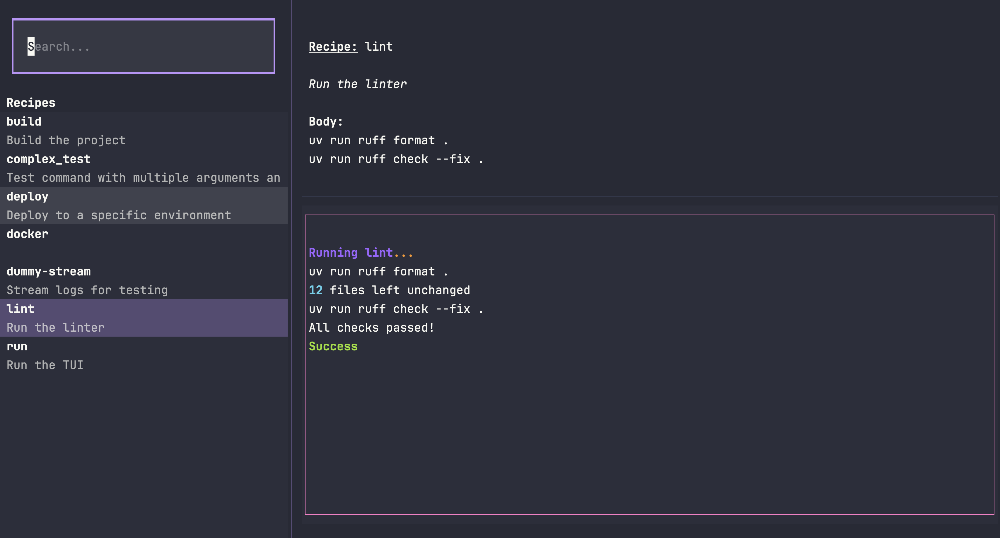
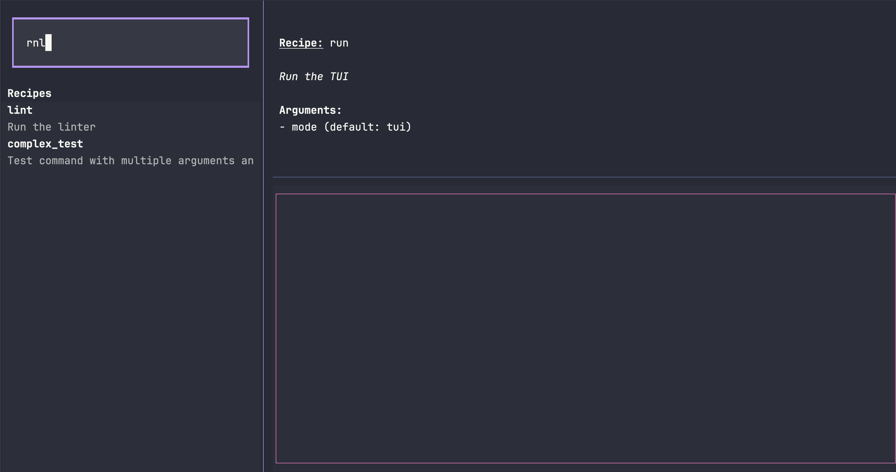
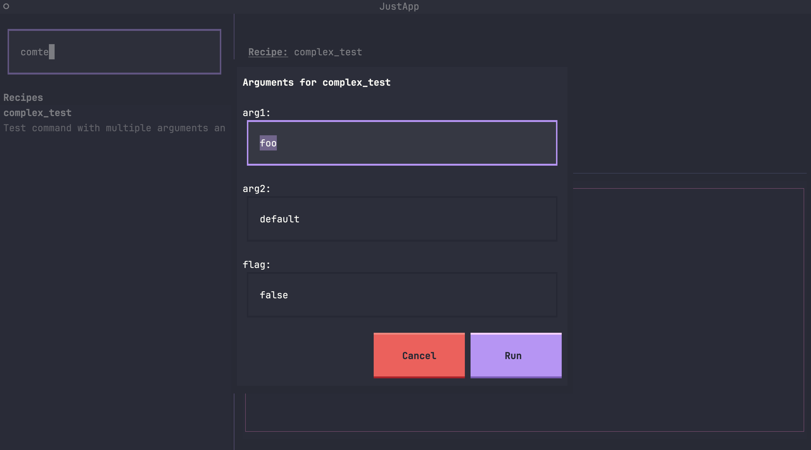

# JustLaunch (`jl`)

A powerful TUI (Terminal User Interface) for your `justfile` recipes. Browse, search, and execute commands with ease.

> **Justfiles are AM-A-ZING.** But let's be real: they have a habit of growing out of proportion. As features pile up, so do the recipes, until your `justfile` becomes a scrolling nightmare.
>
> My brain... isn't quite what it used to be. I needed help remembering if it was `just deploy-prod` or `just prod-deploy`. So I built this UI—a neat, brain-friendly helper to tame your massive `justfiles`.



## Installation

Try it out with:

```bash
uvx --from git+https://github.com/timvancann/justlaunch jl
```

Install/update directly using `uv`:

```bash
uv tool install git+https://github.com/timvancann/justlaunch
```

## Usage

Navigate to any directory containing a `justfile` and run:

```bash
jl
```

Or run as a web app:

```bash
jl serve
```

## Features

### 🔍 Fuzzy Search
Instantly find the recipe you need by typing in the search bar. Filters by name and docstring.



### 🚀 Arguments & Memory
Automatically generated forms for parameterized recipes. **JustLaunch** remembers your previous inputs, making repetitive tasks a breeze.



### ⌨️ Keyboard Shortcuts
Navigate efficiently with full keyboard support:
- **Navigation**: `↑`/`↓` or `j`/`k` to select recipes.
- **Scrolling**: `Ctrl+d`/`Ctrl+u` for logs, `Alt+d`/`Alt+u` for details.
- **Search**: `Ctrl+f` or `/` to focus search.

### 📺 Live Terminal Streaming
Watch command output stream in real-time with full ANSI color support, just like in your terminal.

## Credits

Built with ❤️ using:
- [Textual](https://github.com/Textualize/textual) for the amazing TUI framework.
- [Just](https://github.com/casey/just) for the incredible command runner.
